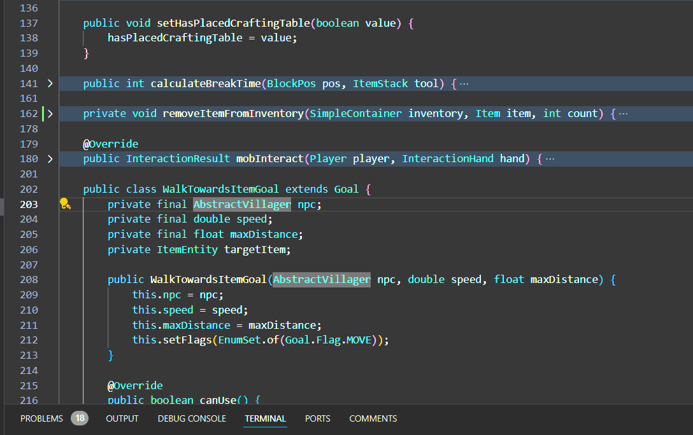

# Copy-Visible-Text
VSCode extension that adds much needed functionality of only copying non collapsed text. useful for sharing code snippets with others or for copying only relevant code for pasting into an llm

## Features

Right click to see the command in the menu or Ctrl + Shift + C. This overrides any existing shortcut for Ctrl + shift + c

> Tip: Many popular extensions utilize animations. This is an excellent way to show off your extension! We recommend short, focused animations that are easy to follow.

## Requirements

None

## Extension Settings

None

## Known Issues

None

## Release Notes

Generated the main script

### 1.1.1

Initial release of Copy Visible Text

